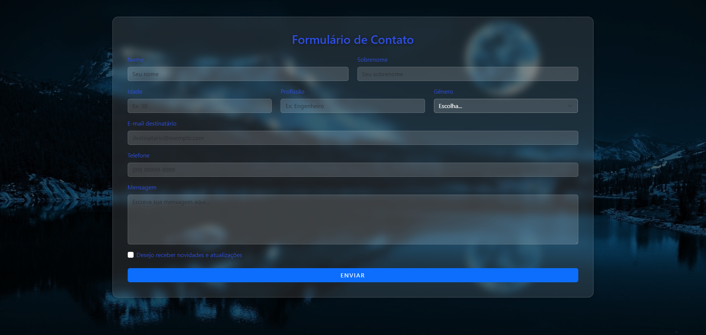

# 📧 Formulário de Envio de E-mail

Este projeto é um **formulário web** desenvolvido com **Flask (Python)** que permite o envio de mensagens por e-mail diretamente através da aplicação.  
O usuário preenche os campos do formulário e o sistema envia os dados para o e-mail do destinatário configurado.

---

## 🚀 Tecnologias utilizadas

- 🐍 **Python 3**
- 🔥 **Flask**
- 💌 **Win32com / Outlook**
- 🎨 **HTML5, CSS3 e Bootstrap**
- ⚡ **JavaScript (Fetch API)**

---

## 🧠 Funcionalidades

✅ Envio de e-mails com campos personalizados  
✅ Validação de formulário  
✅ Feedback visual de sucesso ou erro  
✅ Interface simples e responsiva  

---

## 🖼️ Demonstração



> 💡 Coloque a imagem `preview-form.png` na pasta `static/img/` (ou outro caminho que você usar no seu projeto).

---

## 🧩 Estrutura do projeto

```bash
📂 seu-projeto/
│
├── app.py                # Arquivo principal Flask
├── templates/
│   └── index.html        # Página principal com o formulário
├── static/
│   ├── css/
│   │   └── style.css
│   └── img/
│       └── preview-form.png
└── README.md
